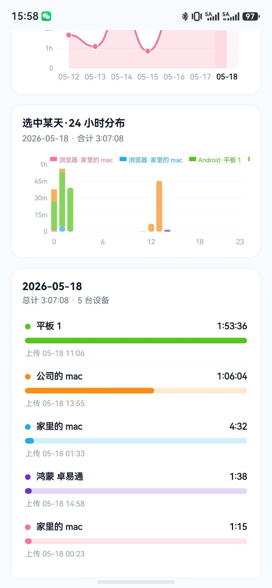
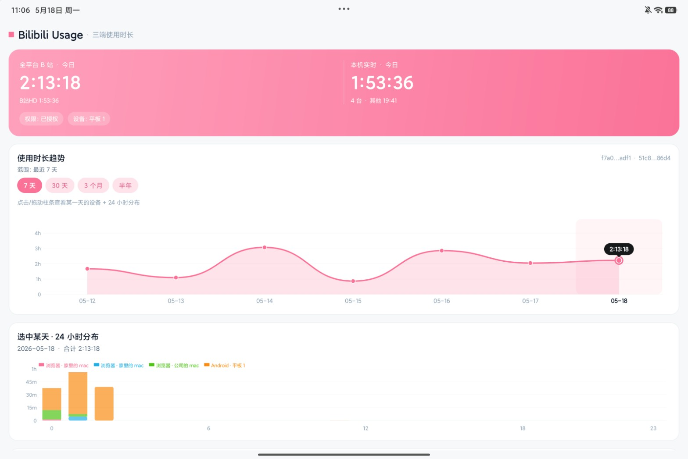
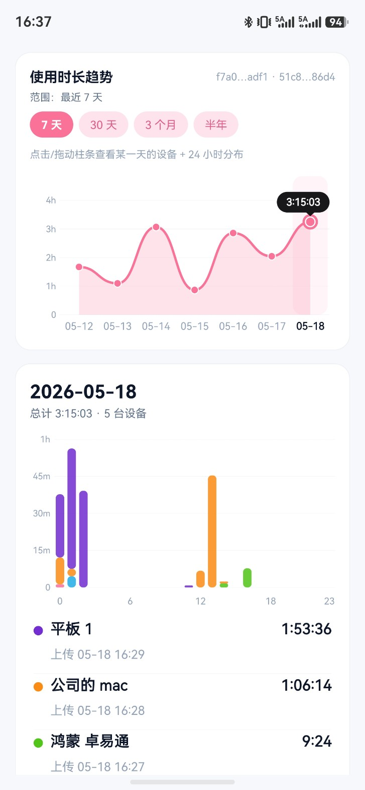

# Bilibili Usage Tracker

> 跨设备 B 站使用时长统计 — Chrome 插件 · Android App

统计你在 B 站上花的每一分钟，数据汇聚到 **Cloudflare D1**（免费数据库），在折线图和 24 小时热力图中一目了然，支持多设备合并查看。

---

## 截图

<table>
  <tr>
    <td align="center">
      <b>Android · Hero + 趋势图</b><br/>
      
    </td>
  </tr>
  <tr>
    <td align="center">
      <b>Android · 趋势图 + 24h 分布 + 设备拆分</b><br/>
      
      &nbsp;&nbsp;
      
    </td>
  </tr>
</table>

---

## ✨ 功能

| | Chrome / Edge 插件 | Android App |
|---|---|---|
| 计时方式 | 前台可见时才计时，切换标签即暂停 | UsageStatsManager 系统级统计 |
| 自动上传 | 每天凌晨自动补传 30 天 | 每天 05:00 自动上传 |
| 手动同步 | Popup 一键上传 | 支持同步 7 天 / 当前范围 / 半年 |
| 趋势图 | 7 / 30 / 90 / 180 天 | 7 天 / 30 天 / 3 个月 / 半年 |
| 24h 热力图 | ✅ 点击某天查看 | ✅ 点击某天查看 |
| 多设备汇总 | ✅ 全设备今日总计 | ✅ 全设备今日总计 |

> **HarmonyOS** 版代码已有基础框架，但鸿蒙目前不向三方应用开放使用时长查询权限，暂无法使用。

---

## 🗄️ 后端：Cloudflare D1（完全免费）

本项目使用 **Cloudflare D1** 作为云数据库，**无需自建服务器，永久免费套餐足够个人使用**（每天 500 万次读、10 万次写）。

### 第一步：创建 D1 数据库

1. 注册/登录 [Cloudflare](https://dash.cloudflare.com/)（免费账号即可）
2. 左侧菜单 → **Workers & Pages → D1** → 点击「Create database」
3. 随意命名（如 `bili_usage`），点击创建
4. 进入数据库详情 → 点击 **Console** 标签页
5. 把 `worker/schema.sql` 的全部内容粘贴进去，点击「Execute」完成建表

### 第二步：获取配置信息

| 配置项 | 获取方式 |
|--------|---------|
| **Account ID** | Dashboard 首页右侧边栏 |
| **Database ID** | D1 数据库详情页 → Settings |
| **API Token** | [My Profile → API Tokens](https://dash.cloudflare.com/profile/api-tokens) → Create Token → 选「D1 Edit」模板 |

> ⚠️ API Token 请只给 D1 读写权限，不要使用 Global API Key。

---

## 🚀 快速开始

### Chrome / Edge 插件

1. 打开 `chrome://extensions/` → 开启「开发者模式」
2. 「加载已解压的扩展程序」→ 选择 `bilibili-usage-extension/` 目录
3. 点击插件图标 → 右上角齿轮 → 填入 Account ID、Database ID、API Token、设备别名
4. 点击「测试连接」，显示"可读可写"即成功

> 也可直接下载 `output/` 中的打包好的 zip，解压后加载。

### Android App

> 需要 Android 6.0+，安装后需授予「使用情况访问权限」

```bash
# 方式一：adb 安装（推荐）
adb install output/bilibili-usage-tracker-v1.4.0.apk

# 方式二：自行编译
cd bilibili-usage-android && ./gradlew installDebug
```

安装后：打开 App → 点击「打开使用情况权限」授权 → 填写 D1 配置 → 点击「同步最近 7 天」

---

## 📁 目录结构

```
bilibili-usage-tracker/
├── bilibili-usage-extension/   # Chrome/Edge 插件源码（MV3）
├── bilibili-usage-android/     # Android App 源码（纯 Java）
├── bilibili-usage-harmony/     # HarmonyOS App（实验性，暂不可用）
├── worker/
│   └── schema.sql              # D1 建表 SQL（初次配置需执行）
└── output/                     # 预编译产物（APK + 插件 zip）
```

---

## 🔒 隐私说明

- API Token 仅存储在本地设备，不经过任何中间服务器
- D1 中只存储时长数值，不包含任何 URL 或浏览内容

---

## 版本

| 平台 | 版本 |
|------|------|
| Chrome 插件 | v1.3.3 |
| Android App | v1.4.0 |

## License

[MIT](LICENSE)
